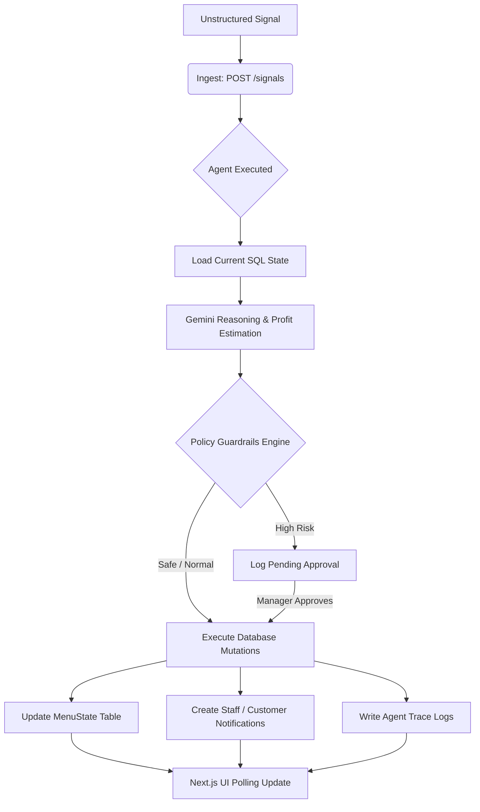

# MenuMind: Autonomous Cafe Operations Agent

## Google Antigravity Hackathon — Challenge 1: Agentic App Workflow Development

MenuMind is a fully autonomous operations agent designed to act as an "Autonomous Store Manager" for a local Pakistani cafe. Unlike basic chatbots, MenuMind is a true agentic system: it observes unstructured real-world signals (supply alerts, weather anomalies, competitor pricing attacks, city strikes), reasons over the live menu state, produces structured strategic execution plans using Gemini, and autonomously executes safe database mutations to optimize revenue and margins, all while enforcing strict policy guardrails.

---

## 📖 Table of Contents
1. [Overall Solution Design](#-overall-solution-design)
2. [Architectural Overview](#%EF%B8%8F-architectural-overview)
3. [The Core Autonomy Loop](#-the-core-autonomy-loop)
4. [APIs Implemented (Real & Mock)](#-apis-implemented-real--mock)
5. [Autonomous Agents & Routing Logic](#-autonomous-agents--routing-logic)
6. [Operational Scenario Demonstrations](#-operational-scenario-demonstrations)
7. [Installation & Local Setup](#%EF%B8%8F-installation--local-setup)
8. [Production Deployment & Environment Guides](#-production-deployment--environment-guides)

---

## 🎨 Overall Solution Design

MenuMind replaces manual store administration with an autonomous **Observe-Reason-Plan-Guard-Execute-Trace** loop. It acts as an intelligent middleware layer between chaotic real-world inputs and the cafe's active operational state.

### Conceptual Dataflow Diagram
```
              [ Messy Raw Signal ] (Supplier WhatsApp, Weather Alert, Strike)
                       │
                       ▼
            [ POST /api/signals ] (Ingestion Layer)
                       │
                       ▼
          [ backend/llm_adapter.py ] 
       (Gemini REST API / Safety Fallback)
                       │
                       ├───────────────────────────┐
                       ▼                           ▼
            [ Structured AgentPlan ]        [ Extracted Facts ]
                       │
                       ▼
          [ backend/agent.py (Guard) ] ──(Threshold/Ethics Check)──┐
                       │                                           │
         ┌─────────────┴─────────────┐                             ▼
         ▼                           ▼                   [ Requires Approval? ]
   [ Safe Action ]             [ Risky Action ]                    │
         │                           │                             ▼
         ▼                           ▼                    [ Approvals Table ]
 [ Direct Execution ]        [ Hold Execution ]                    │
 (Mutate SQLite DB)          (Wait for Manager)                    ▼
         │                           │               [ Manager: "Approve & Execute" ]
         ▼                           ▼                             │
  [ Live Menu Updates ] <──────────────────────────────────────────┘
         │
         ├───────────────────────────┐
         ▼                           ▼
[ Trace Log Database ]       [ Notifications Board ]
         │                           │
         └─────────────┬─────────────┘
                       ▼
         [ Next.js Production UI ] (Planner, Analytics, Audit Log)
```

---

## 🛠️ Architectural Overview

The application is structured as a decoupled multi-service system:

### 1. Python FastAPI Backend (`/backend`)
- **API Engine (`main.py`):** Serves RESTful endpoints handling signal ingestion, agent run execution, approval processing, live menu retrieval, operational traces, and settings management.
- **Agent Orchestrator (`agent.py`):** Manages the chronological lifecycle of a run (loading SQLite state -> generating Gemini plan -> policy guard check -> executing registered tools -> committing SQLite session -> logging traces).
- **Gemini Adapter (`llm_adapter.py`):** Handles model routing, prompt formatting, payload composition, and REST calls to Gemini. Houses the `DeterministicPlanner` fallback to guarantee demo resilience.
- **Tool Registry (`tools.py`):** Defines and validates permitted python operations. Executable tools include database menu adjustments, promotional flagging, staff alerts, and manager-facing approval logs.
- **ORM Database Layer (`models.py` & `schemas.py`):** Implements SQLite structures via SQLAlchemy and defines data-contract schemas via Pydantic.

### 2. Next.js Production Frontend (`/frontend`)
- **Next.js App Router (`frontend/src/app`):** The live surface deployed on Vercel containing interactive business panes:
  - `/planner` (Operations Board): Displays task cards mapped from active runs (*Now / Next / Needs Approval / Done*).
  - `/analytics` (Intelligence Desk): Displays dynamic financial forecasts (Projected Profit, Prevented Stock Loss) alongside E2E pipeline cards.
  - `/settings` (Preferences): Houses threshold configurations and AI decision speeds.
- **Global Theme & Styles (`index.css`):** Implements a premium, **dark glassmorphism** style utilizing modern typography (**Inter**), harmonic radial backgrounds (`#0b0f19` to `#1a2238`), thin boundaries, and subtle micro-interactions.

### 3. Local Simulation GUI (`frontend/src/App.jsx`)
- Built using React and Vite, serving as the local development sandbox. It features preset scenario launchers, raw terminal log streams, immediate before/after state diff highlights, and direct manual overrides.

### 4. Cross-Platform Packages (Tauri & Capacitor)
- **Tauri Wrapper:** Bundles the UI into a native Windows executable located under `Windows Application/`.
- **Capacitor Integration:** Houses configuration files to package the web build into native Android APK shells.

---

## 🔄 The Core Autonomy Loop

Every operation on MenuMind progresses through a strict pipeline:



---

## 🔌 APIs Implemented (Real & Mock)

MenuMind connects a variety of custom real API endpoints with external Gemini integrations and local simulated fallback services:

### 1. Custom Real FastAPI Endpoints
- **Signals:** 
  - `POST /signals` — Ingests a new unstructured text message.
  - `GET /signals` — Lists past signal entries.
- **Agent Operations:**
  - `POST /agent/run/{signal_id}` — Executes the active agent pipeline over a specific signal.
  - `GET /agent/runs` — Returns run histories including final plan schemas.
  - `GET /agent/runs/{run_id}/traces` — Fetches step-by-step reasoning steps for the trace terminal.
- **Menu State:**
  - `GET /menu/state` — Retrieves the current live inventory, prices, prep times, and promo markers.
  - `POST /menu/reset` — Resets menu inventory back to default baseline standards.
- **Approvals & Guardrails:**
  - `GET /approvals` — Retrieves pending manager reviews.
  - `POST /approvals/{approval_id}/approve` — Executes an intercepted transaction after manager verification.
- **Notifications:**
  - `GET /notifications` — Displays active staff warnings or customer announcements.
- **System Settings:**
  - `GET /settings` / `POST /settings` — Controls confidence thresholds, decision models, and speed.
- **Analytics:**
  - `GET /analytics/throughput` — Measures system load and real-time operational volume.

### 2. External / Real Integration APIs
- **Gemini REST API:** Calls Google's Gemini models directly using raw JSON payloads, supporting API keys, timeouts, and structured output formatting.
- **Open-Meteo Weather API:** Utilized inside `backend/weather.py` to extract local weather conditions (real temperature and forecast alerts) without requiring complex authentication credentials.

### 3. Mock / Fallback Services
- **DeterministicPlanner Fallback:** If Gemini is unreachable, has insufficient rate limits, or lacks an API key, `llm_adapter.py` seamlessly redirects processing to a deterministic pattern adapter. This analyzes the text query for key indicators (e.g., "chicken", "heatwave", "strike") and returns a clean, mock `AgentPlan` schema, ensuring the application remains 100% stable during live judging.

---

## 🤖 Autonomous Agents & Routing Logic

### The Gemini Agent Planner
The primary agent is driven by `backend/agent.py`. It translates raw inputs into structured strategies using the following prompt injection rules:
- **Context Injection:** Raw signal text is combined with the active list of menu database records and weather states.
- **Schema Enforcement:** Gemini is instructed to output JSON matching the `AgentPlan` Pydantic model containing:
  - `extracted_facts`: Bulleted list of facts derived from the signal.
  - `strategic_rationale`: Business analysis explaining *why* actions are planned.
  - `actions`: List of structured actions detailing the target tool name, key-value parameters, and strategic priority.
  - `revenue_impact_estimate`: Margin changes and customer demand impact forecasts.

### Dynamic Model Routing (Decision Speed)
Settings map user-selected operational preferences to distinct backend Gemini models:
- ⚡ **Fast Speed:** Routed to `gemini-2.5-flash` for rapid operations.
- ⚖️ **Balanced Speed:** Routed to `gemini-2.5-pro` for deep reasoning.
- 🧠 **Thorough Speed:** Routed to `gemini-3-flash-preview` for high-depth logical planning.

### Ethical Policy Guardrail Engine
The agent evaluates decisions through safety rules:
- **surge_pricing_prevention:** If a signal is identified as a crisis (e.g., strike, flood), the system blocks automated price increases, forcing any price hikes or item mutations into a **pending approval state** to prevent price gouging.
- **financial_margin_cap:** If a price adjustment exceeds **15%** of the base cost, it is flagged as unsafe and held.
- **auto_approve_threshold:** If the agent's confidence score falls below **70%**, operations are locked until a manual review is performed.

---

## 🎭 Operational Scenario Demonstrations

The system is pre-configured with 5 distinct test scenarios to prove its adaptive autonomy:

1. **Supply Shock (Chicken Delivery Failure):**
   - *Signal:* "Chicken supplier broke down, no shipment today."
   - *Result:* Freezes "Chicken Wrap" (availability = False), highlights "Beef Wrap" as a replacement, and broadcasts kitchen alerts.
2. **Contradiction Guard (Stock Safety Buffer):**
   - *Signal:* "Severe beef delivery shortage today."
   - *Logic:* System checks the database and spots high existing stock (e.g., 85 units).
   - *Result:* Instead of prematurely hiding the Beef Burger, it merely extends kitchen prep time by +10 minutes, protecting potential sales.
3. **Heatwave Demand Shift (Karachi 44°C):**
   - *Signal:* "Heatwave warning: Karachi hitting 44°C."
   - *Result:* Flags "Iced Mint Lemonade" as promoted, reduces hot drink exposure, and instructs staff to double ice production.
4. **Competitor Price Attack:**
   - *Signal:* "Rival cafe drops Club Sandwich price to 200 PKR."
   - *Result:* Smartly discounts our sandwich to a balanced 250 PKR with a promo banner rather than starting an aggressive, margin-destroying price war.
5. **Force-Majeure Crisis (Floods/Strikes):**
   - *Signal:* "Flash flooding has blocked Faizabad roads."
   - *Result:* Ethical intercept blocks all changes, creates a pending approval card, and requests manager review before broadcasting customer care notifications.

---

## ⚙️ Installation & Local Setup

### System Prerequisites
- Python 3.9 or higher
- Node.js 18.x or higher
- npm or yarn

### 1. Backend Setup
Navigate to the backend directory, install requirements, and boot up the development server:
```bash
cd backend
python -m venv .venv
# Activate on Windows:
.venv\Scripts\activate
# Install dependencies:
pip install -r requirements.txt
# Run Uvicorn:
python -m uvicorn main:app --port 8000 --reload
```
Create a `.env` file inside `backend/` and supply your Gemini API key:
```env
GEMINI_API_KEY=your_google_gemini_api_key_here
GEMINI_MODEL=gemini-1.5-flash
```

### 2. Frontend Setup
Navigate to the frontend directory, install dependencies, and launch Vite (local simulator) or Next.js:
```bash
cd frontend
npm install
# Run local simulator (Vite):
npm run dev
# Run production compiler (Next.js):
npm run build
npm run start
```
By default, the local frontend connects to the backend at `http://localhost:8000`.

---

## 🌐 Production Deployment & Environment Guides

### Render Backend Configuration
1. Connect this repository to your **Render** dashboard.
2. Set up a **Web Service** using the Python runtime.
3. Apply the following variables in the Render environment panel:
   - `GEMINI_API_KEY`: *(Your secret API key)*
   - `GEMINI_FAST_MODEL`: `gemini-2.5-flash`
   - `GEMINI_BALANCED_MODEL`: `gemini-2.5-pro`
   - `GEMINI_THOROUGH_MODEL`: `gemini-3-flash-preview`
   - `AUTO_APPROVE_THRESHOLD`: `70`

### Vercel Frontend Configuration
1. Connect the repository to **Vercel**.
2. Point the framework preset to **Next.js**.
3. Supply the production environment variable:
   - `NEXT_PUBLIC_API_URL`: `https://menumind-backend.onrender.com` *(Pointed to your active Render backend)*

### Capacitor Mobile Build (Android APK)
To build a physical mobile package, utilize our Android build configuration:
1. Ensure the backend URL is mapped correctly in variables:
   - For emulator: `NEXT_PUBLIC_API_URL=http://10.0.2.2:8000`
   - For production: Use your live Render HTTPS URL.
2. Build your assets and sync Capacitor:
   ```bash
   cd frontend
   npm run build
   npx cap sync android
   npx cap open android
   ```
3. Compile a debug package (`app-debug.apk`) inside Android Studio and install it on your device.

---
*Built with passion for the Google Antigravity Hackathon.*
