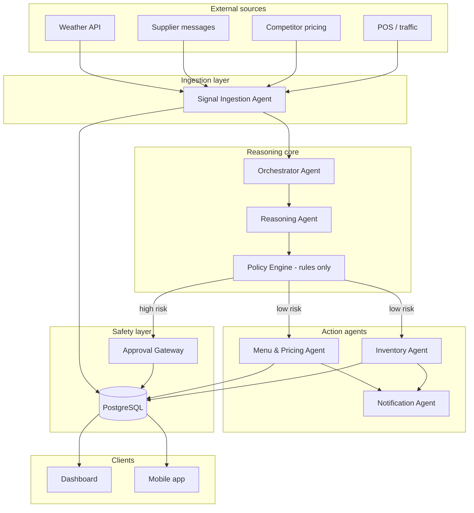

# MenuMind AI Agents — Implementation Plan

> **Purpose:** Turn MenuMind from a dashboard with seeded/API data into a **live autonomous operations system** for small cafes — ingesting external signals, reasoning with business rules, updating the database safely, and routing high-risk changes through human approval.

**Related docs:** [overview.md](./overview.md) · [features.md](./features.md) · [progress.md](./progress.md) · [ai-agents-progress.md](./ai-agents-progress.md) · [todos.md](./todos.md)

---

## 1. Product goal (what the agents must achieve)

| Capability | Agent responsibility |
|------------|-------------------|
| Ingest unstructured inputs | Supplier SMS/email, weather APIs, competitor price feeds, POS events |
| Structure & classify | Normalize into `Signal` records with type, priority, metadata |
| Assess impact | LLM reasoning + deterministic policy rules |
| Propose actions | Price/menu/inventory/staffing recommendations with confidence |
| Safe execution | Auto-apply low-risk; queue high-risk as `Approval` |
| Live visibility | Dashboard + mobile reflect DB changes in real time |
| Auditability | Every decision → `ReasoningItem` + `AuditLog` |

**Golden rule:** *LLMs propose; rules + thresholds decide; humans approve what exceeds policy.*

---

## 2. Current state vs target

### Already built (use as foundation)

| Layer | Status |
|-------|--------|
| **Frontend** | Operations, Approvals, Audit Log, Inventory, Analytics, AI Logs — hooks + API client |
| **Backend** | Express + Prisma + PostgreSQL — CRUD for signals, approvals, menu, risks, insights |
| **Data models** | `Signal`, `Approval`, `AuditLog`, `MenuItem`, `InventoryRisk`, `AiInsight`, `PolicyLimit`, `AiPreferences` |
| **Auth** | JWT per cafe user |
| **Polling** | Inventory/operations refresh intervals (not true push yet) |

### Missing for automation

- No LLM reasoning pipeline (decisions are seeded/static)
- No external signal connectors (weather, supplier, competitor)
- No job queue / agent runtime
- No structured **Decision** schema (proposal → validate → execute)
- No WebSocket/SSE for instant UI updates
- No action executors (apply price, hide menu item, send notification)

---

## 3. Agent architecture (high level)



---

## 4. Agent roster (7 agents)

### 4.1 Signal Ingestion Agent
**Role:** Poll/webhook external sources → create `Signal` rows.

| Input | Output |
|-------|--------|
| Raw webhook body, API JSON, email parse | `Signal { type, source, message, priority, metadata }` |

**Does not** call LLM for every ping; uses light classification (rules/regex) first, LLM only for ambiguous supplier text.

---

### 4.2 Orchestrator Agent
**Role:** Central scheduler — picks work from queue, invokes other agents, tracks run state.

| Triggers | Actions |
|----------|---------|
| New signal | Start reasoning workflow |
| Cron (every 5–15 min) | Poll connectors |
| Approval approved/rejected | Run execution or rollback path |

**Implementation:** LangGraph graph or `p-queue` worker coordinator (see packages below).

---

### 4.3 Reasoning Agent
**Role:** Given signal(s) + cafe context, produce a **structured decision proposal**.

**Context bundle:**
- Recent signals (last N)
- Menu items + prices
- Inventory risks
- Policy limits (`PolicyLimit`)
- User `AiPreferences` (auto-approve threshold, risk tolerance)

**Output schema (Zod):**
```typescript
{
  signalType: 'Pricing' | 'Inventory' | 'Menu' | 'Staffing' | 'Demand';
  title: string;
  description: string;
  recommendation: string;
  confidence: number;        // 0-100
  impact: { revenue?, waste?, labor? };
  suggestedActions: Action[]; // typed actions
  reasoning: string;          // human-readable chain
}
```

Persists → `ReasoningItem` + draft `Approval` if confidence/policy requires review.

---

### 4.4 Policy Engine (not an LLM agent)
**Role:** Deterministic gate — **never** let the model bypass rules.

| Rule source | Examples |
|-------------|----------|
| `PolicyLimit` DB | max price change ±20%, min confidence 85% |
| `AiPreferences` | auto-approve if confidence ≥ threshold |
| Hardcoded safety | Never delete menu items; cap single price delta |

Returns: `{ allowed: 'auto' | 'approval' | 'deny', reasons: string[] }`.

---

### 4.5 Menu & Pricing Agent
**Role:** Execute approved pricing/menu actions.

| Action types | DB effect |
|--------------|-----------|
| `ADJUST_PRICE` | Update `MenuItem.price` (within policy %) |
| `SET_STATUS` | `MenuItem.status` → DYNAMIC / FIXED / WASTE_RISK |
| `PROMOTE_ITEM` | Create `AiInsight` or flag for upsell |
| `HIDE_ITEM` | status or availability flag |

Writes `AuditLog` on every mutation.

---

### 4.6 Inventory Agent
**Role:** Stock risk, reorder suggestions, waste prevention.

| Action types | DB effect |
|--------------|-----------|
| `UPDATE_RISK` | `InventoryRisk` alertLevel / status |
| `CREATE_INSIGHT` | `AiInsight` for staff |
| `ADJUST_PAR` | future: par level field on inventory model |

Pairs with supplier signals from Ingestion Agent.

---

### 4.7 Notification Agent
**Role:** Staff/customer alerts after decisions.

| Channel | Package |
|---------|---------|
| Email | Resend |
| SMS | Twilio |
| In-app | `Signal` + push (future FCM) |

Respects `NotificationSettings` per user.

---

### 4.8 Approval Gateway (workflow, not LLM)
**Role:** Bridge to existing `/approvals` UI.

- Creates `Approval` with `status: pending`
- On approve → Orchestrator runs Menu/Inventory agents
- On reject → `AuditLog` + optional feedback for learning (future)

---

## 5. Recommended packages

### Tier 1 — Install first (core agent stack)

| Package | Version target | Why |
|---------|----------------|-----|
| **`ai`** (Vercel AI SDK) | ^4.x | Structured LLM calls, streaming, tool calling from Node/Next |
| **`@ai-sdk/openai`** | ^1.x | GPT-4o / o-series for reasoning |
| **`@ai-sdk/anthropic`** | ^1.x | Optional Claude for long-context supplier emails |
| **`zod`** | ^3.x | ✅ Already in backend — decision schemas |
| **`p-queue`** | ^8.x | In-memory job queue for agent runs (MVP) |
| **`langsmith`** | optional | Trace/debug agent chains in dev |

### Tier 2 — Orchestration (pick one path)

| Option | Packages | Best when |
|--------|----------|-----------|
| **A. LangGraph** (recommended) | `@langchain/langgraph`, `@langchain/core`, `@langchain/openai` | Multi-step agents, human-in-the-loop, retries, branching |
| **B. Lightweight** | `ai` + custom TypeScript state machine | Smaller MVP, fewer dependencies |
| **C. Inngest** | `inngest` | Serverless, cron + event-driven without managing Redis |

**Recommendation:** Start with **B** for MVP (2–3 weeks), migrate hot paths to **A** when workflows grow.

### Tier 3 — Connectors & realtime

| Package | Purpose |
|---------|---------|
| **`node-cron`** | Scheduled weather/competitor polls |
| **`socket.io`** + **`socket.io-client`** | Push dashboard updates |
| **`resend`** | Transactional email |
| **`twilio`** | SMS supplier alerts / staff paging |
| **`openmeteo`** or raw `fetch` | Weather (no key required for Open-Meteo) |

### Tier 4 — Optional / later

| Package | Purpose |
|---------|---------|
| **`@trigger.dev/sdk`** | Alternative to Inngest |
| **`pgvector`** + **`@prisma/extension-pgvector`** | RAG over past decisions / SOP docs |
| **`@cursor/sdk`** | Dev-only: codegen, PR agents — **not** runtime cafe automation |

### Monorepo layout (suggested)

```
MenuMind/
├── backend/
│   ├── src/
│   │   ├── agents/
│   │   │   ├── orchestrator/
│   │   │   │   ├── graph.ts          # LangGraph or state machine
│   │   │   │   └── worker.ts         # Queue processor
│   │   │   ├── ingest/
│   │   │   │   ├── weather.connector.ts
│   │   │   │   ├── supplier.connector.ts
│   │   │   │   └── competitor.connector.ts
│   │   │   ├── reasoning/
│   │   │   │   ├── reasoning.agent.ts
│   │   │   │   └── prompts/
│   │   │   ├── policy/
│   │   │   │   └── policy.engine.ts  # pure functions, no LLM
│   │   │   ├── actions/
│   │   │   │   ├── menu.agent.ts
│   │   │   │   └── inventory.agent.ts
│   │   │   ├── notify/
│   │   │   │   └── notification.agent.ts
│   │   │   └── schemas/
│   │   │       └── decision.schema.ts
│   │   ├── queues/
│   │   │   └── index.ts
│   │   └── ... (existing routes/services)
│   └── package.json
├── frontend/          # existing Next.js dashboard
└── docker-compose.yml # postgres
```

---

## 6. New database models (Prisma)

Add in a future migration:

```prisma
model AgentRun {
  id          String   @id @default(uuid())
  agentName   String
  status      String   // queued | running | completed | failed
  input       Json?
  output      Json?
  error       String?
  startedAt   DateTime?
  completedAt DateTime?
  createdAt   DateTime @default(now())
}

model AgentDecision {
  id            String   @id @default(uuid())
  runId         String?
  signalIds     String[] // or relation table
  proposal      Json     // structured DecisionProposal
  policyResult  String   // auto | approval | deny
  approvalId    String?
  executedAt    DateTime?
  createdAt     DateTime @default(now())
}

model ExternalSource {
  id        String   @id @default(uuid())
  cafeId    String
  type      String   // weather | supplier | competitor | pos
  config    Json     // API keys, endpoints (encrypted at app layer)
  enabled   Boolean  @default(true)
  lastSync  DateTime?
}
```

---

## 7. Environment variables

```env
# LLM
OPENAI_API_KEY=
ANTHROPIC_API_KEY=          # optional

# Queue
# Queue (using in-memory p-queue, so no Redis URL needed for MVP)

# Connectors
OPEN_METEO_LAT=37.7749
OPEN_METEO_LON=-122.4194
COMPETITOR_PRICE_API_URL=
SUPPLIER_WEBHOOK_SECRET=

# Notifications
RESEND_API_KEY=
TWILIO_ACCOUNT_SID=
TWILIO_AUTH_TOKEN=
TWILIO_FROM_NUMBER=

# Agent tuning
AGENT_AUTO_APPROVE_DEFAULT=95
AGENT_POLL_INTERVAL_MS=300000
```

---

## 8. Phased roadmap

### Phase 0 — Foundation (Week 1)
- [ ] Add `backend/src/agents/schemas/decision.schema.ts` (Zod)
- [ ] Implement `policy.engine.ts` using existing `PolicyLimit` + `AiPreferences`
- [ ] Add `p-queue`; `docker-compose` with postgres only
- [ ] `POST /api/agents/webhooks/supplier` stub
- [ ] `AgentRun` table + logging

**Exit criteria:** Policy engine unit tests; job enqueues and logs.

---

### Phase 1 — Reasoning loop (Week 2)
- [ ] Reasoning Agent: signal → structured proposal (Vercel AI SDK + Zod)
- [ ] Persist `ReasoningItem` + conditional `Approval`
- [ ] Wire Operations dashboard “AI command” to enqueue reasoning job
- [ ] Manual trigger: `POST /api/agents/run` (admin only)

**Exit criteria:** New signal in DB → reasoning card appears in UI within one job cycle.

---

### Phase 2 — Ingestion (Week 3)
- [ ] Weather connector (Open-Meteo) → heat/rain signals
- [ ] Cron worker every 15 min
- [ ] Supplier webhook parser (template messages → inventory signals)
- [ ] Competitor price diff detector (mock CSV/API first)

**Exit criteria:** At least two live external signal types without manual seeding.

---

### Phase 3 — Execution + approvals (Week 4)
- [ ] Menu & Pricing Agent executors
- [ ] Inventory Agent executors
- [ ] Approval approve → execute pipeline
- [ ] Audit log for every auto + manual action

**Exit criteria:** Approve price change in UI → `MenuItem.price` updates in DB.

---

### Phase 4 — Realtime dashboard (Week 5)
- [ ] Socket.io on Express; emit on signal/approval/menu change
- [ ] Frontend subscribe in `useOperationsData` / `useInventoryData`
- [ ] Reduce polling where push exists

**Exit criteria:** Two browser tabs; action in one updates the other without refresh.

---

### Phase 5 — Notifications (Week 6)
- [ ] Notification Agent + Resend/Twilio
- [ ] Respect `NotificationSettings`
- [ ] Escalation: CRITICAL risk → SMS if enabled

---

### Phase 6 — Hardening (ongoing)
- [ ] Idempotency keys on actions
- [ ] Rollback on failed execution
- [ ] Rate limits on LLM calls
- [ ] LangGraph migration for complex branches
- [ ] RAG over cafe SOP PDFs (optional)
- [ ] Mobile app API parity

---

## 9. Mapping agents → existing UI

| UI page | Agent touchpoints |
|---------|-------------------|
| **Operations /** | Live signals from Ingestion; reasoning feed from Reasoning Agent |
| **Approvals** | Approval Gateway output |
| **Audit Log** | All executed decisions |
| **Inventory** | Menu/Inventory agents + metrics recalc |
| **AI Logs** | `ReasoningItem` history with detail from `AgentDecision` |
| **Analytics** | Aggregated throughput from real agent activity |
| **Settings → AI Preferences** | Policy Engine inputs |

---

## 10. Safety checklist (non-negotiable)

1. **Structured outputs only** — parse with Zod; reject malformed LLM JSON.
2. **Policy before execute** — no direct DB writes from LLM tool calls without Policy Engine pass.
3. **Price caps** — enforce `PolicyLimit` max % change server-side.
4. **Human gate** — confidence < threshold OR risk=high → `Approval` only.
5. **Audit everything** — `AuditLog` row per mutation with `agentName` + `runId`.
6. **Secrets** — connector keys in env / encrypted `ExternalSource.config`, never in prompts.
7. **Dry-run mode** — `AGENT_DRY_RUN=true` logs proposals without writes (dev/staging).

---

## 11. First sprint (start here)

### Install (backend)

```bash
cd backend
npm install ai @ai-sdk/openai zod p-queue node-cron
npm install -D @types/node-cron
# Optional Phase 2+
npm install @langchain/langgraph @langchain/core @langchain/openai
```

### Create files (minimal MVP)

1. `src/agents/schemas/decision.schema.ts`
2. `src/agents/policy/policy.engine.ts`
3. `src/agents/reasoning/reasoning.agent.ts`
4. `src/queues/agent.queue.ts`
5. `src/routes/agents.routes.ts` → mount at `/api/agents`
6. `src/index.ts` → start queue worker + cron

### Prompt sketch (Reasoning Agent)

```
You are MenuMind's cafe operations analyst.
Given signals and menu/inventory context, propose ONE actionable decision.
Output JSON matching DecisionProposal schema.
Never exceed policy limits. Prefer reversible actions.
```

---

## 12. Success metrics

| Metric | Target |
|--------|--------|
| Signal → proposal latency | < 30s (async job) |
| Auto-approved actions | < 20% of total in month 1 (tune upward carefully) |
| Approval SLA | Staff sees queue within 5s (push) |
| Bad action rollback | 100% auditable, manual revert path |
| LLM cost per cafe/day | Track via LangSmith / custom `AgentRun` cost field |

---

## 13. What NOT to use Cursor SDK for

The **Cursor TypeScript SDK** (`@cursor/sdk`) is for running Cursor coding agents in CI/scripts — **not** for production cafe runtime. Use OpenAI/Anthropic via Vercel AI SDK or LangChain for operational decisions.

---

## 14. Next document updates

When starting Phase 0, update:
- [ai-agents-progress.md](./ai-agents-progress.md) — check off tasks and phase status (primary tracker)
- [progress.md](./progress.md) — add “AI Agents” section if needed
- [todos.md](./todos.md) — link tasks to phases above
- [features.md](./features.md) — document `/api/agents` endpoints

---

*Last updated: 2026-03-19 — MenuMind automation plan v1*
